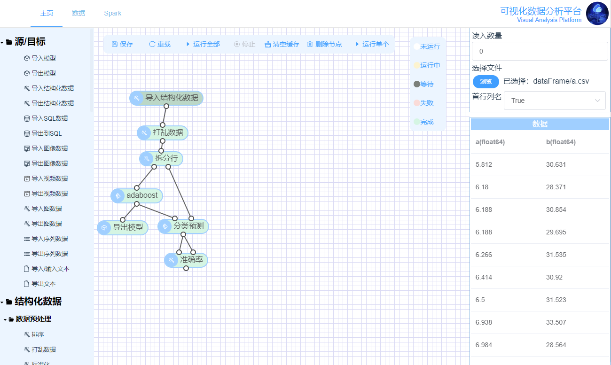

# Visual Analysis Platform Backend
无编程平台，可以让编程小白轻松完成一个数据挖掘流程的构建

如图，从左侧的组件栏选择想要执行的任务，拖入右侧的画布。可以通过拖动组件的输出端到其他组件的输入端标记数据流向。

选中画布中的组件，就可以在右侧出现的框中调整参数以及查看节点数据。

在流程图完成构建之后，点击画布上方的运行全部即可开始整个流程图的计算。



# 前端
[这里](https://github.com/yjwang12/front)

# 文档
[文档](https://github.com/cutrain/visual-analysis-platform/blob/master/manual.doc?raw=true)

### 运行环境要求
```
redis
python >= 3.4
```

### Ubuntu 安装
Install python3 & pip & redis
```bash
sudo apt-get install python3 python3-pip
sudo apt-get install redis-server
```
Download source
```bash
git clone https://github.com/cutrain/visual-analysis-platform
```
Install enviroments
```bash
cd visual-analysis-platform
make install
```
or
```bash
cd visual-analysis-platform
pip install -r requirements.txt
wget -P app/graph/algorithm/image/yolov3 https://pjreddie.com/media/files/yolov3.weights 
```

### windows(x64) 安装
```
download python3 from "https://www.python.org/downloads/"
download redis from "https://github.com/MicrosoftArchive/redis/releases"
pip install -r requirements.txt
download yolov3 weights from https://pjreddie.com/media/files/yolov3.weights, and put in app/graph/algorithm/image/yolov3

```


## 运行后端
```bash
python3 manage.py runserver -p 8080
```
or
```bash
make run
```
访问 http://localhost:8081/component 可以进入组件管理界面


bug反馈或其它问题请联系 duanyuge@qq.com 或 微信 cutrain_

